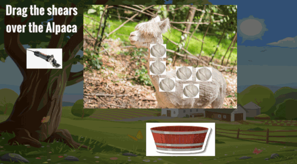
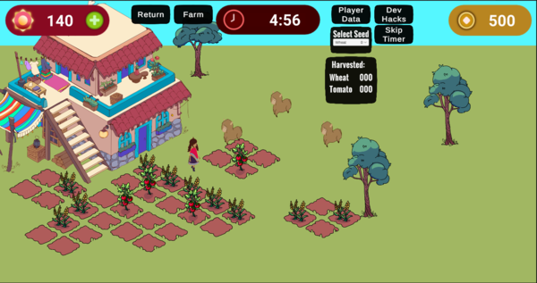
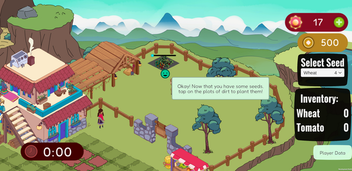

# PacaPomo 🦙

*PacaPomo is an alpaca farming-simumator that utilizes an in-game pomodoro for productiveness.*

*Development for PacaPomo began in summer 2022 as a project produced by <a href="https://gameheadsoakland.org/" target="_blank">Gameheads</a> students. Adaya is one of two programmers and her contributions to this project consisted primarily of gameplay mechanics. The demo release is TBD and development is still underway.*

## Code Samples 🌽
- Alpaca Shearing Minigame
  - <a href="" target="_blank">UI Controller</a>
  - <a href="" target="_blank">Draggable Items</a>

## Gameplay 🌽
  

## In-Game Screenshots 🌽
  
